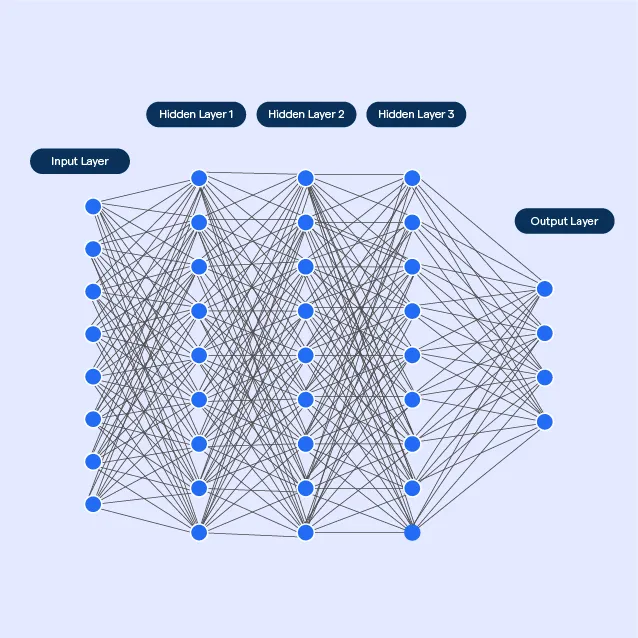

This project is: <b>INCOMPLETE</b><br>
This is part of the PORTFOLIO project - A list of projects designed to showcase various skills I love to learn. Projects include:

- [Regression techniques from scratch](https://github.com/jrobo-gith/Regression-techniques-from-scratch)
- [Building a neural network from scratch](https://github.com/jrobo-gith/NN-from-scratch)
- [Building CNN using Pytorch](https://github.com/jrobo-gith/MNIST-CNN)


# Building a Neural Network from scratch
Building neural networks with a package such as Pytorch is a streamlined way of building your first neural net. It (really usefully) wraps up the math used in these networks and makes it almost disappear. This workflow is optimised for two objectives: 1. to build your first neural network to get you intrigued without being slowed by the maths, and 2. for experts who already understand the math and would actually just like to work with the data. The middle ground, where one has built and tested neural networks using Pytorch, but are not absolutely confident about what goes on 'under the hood' is the problem I'm trying to fix. This problem needs fixing if I'm to understand how these processes can be adapted / optimised and eventually land a job in this field. Hence, this project is about addressing this problem by building a neural network from scratch, only using the numpy module. 

## Context
Neural networks (NNs) like onions, are made of layers. An $\textit{input layer}$ where a single or vector of inputs can be fed into the NN, and an $\textit{output layer}$, again the output could be singular (scalar) or contain a vector of outputs, and in the middle, $\textit{hidden layers}$. These hidden layers are where the magic happens. A shallow NN, a network with one hidden layer, given a large enough hidden layer, can approximate any function under the [universal approximation theorem](https://en.wikipedia.org/wiki/Universal_approximation_theorem), but in practice, needs so many nodes within this single hidden layer, that it becomes inefficient given some complex continuous function. An alternative is stacking these hidden layers together to form a deep neural network, able to achieve similar representations of continuous functions but using a lot fewer neurons (specific nodes in each layer). 

## The magic
As we said above, the hidden layers are filled with nodes. Each node has a $\textit{weight}$ that comes with it which is updated with each pass back through the network (backpropagation). Each hidden layer also comes with a $\textit{bias}$ that gets added to the weights at each layer. We train the NN by feeding through some training $x$ data, then use the NN, initialised with random weights, to predict an output $y$, whereupon a loss function will determine how "correct" the weights are. We then use the optimizer to perform backpropagation through the network to update the weights according to the loss function, whereupon we then feed through more $x$ data. We repeat the process until the loss function is below a certain tolerance.

## Risks 
#### Overfitting
Training the network by letting it go through the training data over and over again (epochs) is a good way to fit your training data well, but the network will likely not be $\textit{generalisable}$ to your test data. This is why we have $\textit{regularisation}$, where larger values for the loss function are punished to avoid the weights changing drastically. There are other ways to regularise NNs as well.

#### Vanishing gradients
This was an early problem in training deep neural networks, where each pass of backpropagation causes the gradients to become smaller and smaller, until the weights stop updating all together. To fix this, we introduce the $\textit{ReLU}$ function, where the outputs of a layer are clamped to never go below 0, solving the vanishing gradients problem. 



Figure 1: Typical NN with an input layer, three hidden layers, and an output layer.

## This project
In this project, we build a neural network from scratch, only using numpy to compute mathematical operations such as ```np.dot(x,y)```. We will then train this neural network on the MNIST numbers dataset and evaluate its performance. If it does well, we can also evaluate it on the fashion MNIST dataset. 


## Problems
One problem I ran into was the inputs to each layer were becoming increasingly large, eventually reaching $e^9$ near the end. This was because even though I had initialised my weights between 0 and 1, there was nothing stopping the inputs reaching incredibly large values due to the ReLU activation function not clamping any values.
I solve this using He initialisation, we initialise the weights according to a gaussian distribution with $\mu = 0$ and $\sigma = \sqrt{2/n}$ where $n$ is the number of input units, this works especially well for ReLU activation functions. This changed our code for the input weights, for example, to ```params = {"W_inputs": np.random.uniform(0, 1, size=(num_inputs, HL_structure[0]))}``` to ```params = {"W_inputs": np.random.normal(0, 2/num_inputs, size=(num_inputs, HL_structure[0]))}``` 


 

